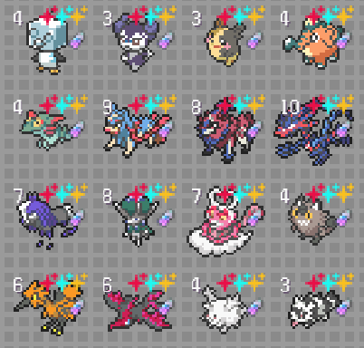

# OfflineRogueEditor
> **OfflineRogueEditor** is a solution for editing save files in an local ran version of pokerogue written in Python.

> [If you are looking for an Editor to edit your Official Online Saves - Check this out](https://github.com/rogueEdit/OnlineRogueEditor/)

> [Join our Discord for more information and hangouts!](https://discord.gg/8ZAnsZfVQP)



## To offline play in the first place you need

- [Official pokerogue's version](https://github.com/pagefaultgames/pokerogue)
- [Admiral-Billy's version](https://github.com/Admiral-Billy/Pokerogue-App)

## Using the tool for the Admiral-Billy's version
```diff
- Remember to make backups of your unaltered data before editing it!
+ For an animated tutorial how to install, scroll to the bottom!
```
- Step 1: Open the game and press M or ESC > Manage Data:
    - Export Data will prompt you to save a file named `data_Guest.prsv` which is is your savefile-data
    - Export Session will prompot you to save a file named `dataSession_Guest.prsv` which will contain the data of the gamesave slot you have choosen;
- Step 1: Open the game and press M or ESC > Manage Data:
    - Export Data will prompt you to save a file named `data_Guest.prsv` which is is your savefile-data
    - Export Session will prompot you to save a file named `dataSession_Guest.prsv` which will contain the data of the gamesave slot you have choosen;
- Step 2: When you have the .prsv file ready on your hands, copy it and make a backup! Open the `SavefileConverter` by double clicking the `index.html` inside or opening it with your favorite browser.
- Step 3: Press `Choose File` and select the .prsv file you just created and press `Decrypt and Download`; a `data_guest.json` should be in your download history. Move this file into the folder `compiled/editor/`
- Step 4: Run `offlineEditor.exe` or execute the shell script depending on your operating system as Administrator or root; Make all the modifications you need and follow along the tool. All changes will be automatically saved.
- Step 5: When you are done editing, Open the `SavefileConverter` by double clicking the `index.html` inside or opening it with your favorite browser. Press  `Choose File`, load the .json file from `compiled/editor` and choose `Encrypt and Download`; Your modified PokeRoGue Savedata will be now in your downloads as a .prsv file!
- Step 6: After you have finished, go back in the game, press M and then select:
    - For the trainer data `Import Data`: make sure to choose the updated .prsv file(the one in the `compiled/editor` folder);
    - For the gamesave slot data choose `Import session`(make sure to select the updated .prsv file);

## Using the tool for the Official Pokerogue's version 
```diff
- Remember to make backups of your unaltered data before editing it!
```

- Step 1: Go into `compiled/` and copy the `patch/` folder into the root directory of the official pokerogue's build;
- Step 2: Open the patch folder that you just copied in the pokerogue directory and run as administrator `patcher.exe` or execute the shell script depending on your operating system;
- Step 3: Run pokerogue as instructed in their github repo. 
- Step 4: Press M and press Manage Data, you'll get two export options:
    - Export Data will prompt you to save a file including all your save data.
    - Export Session will prompt you to save a file which will contain the data of the gamesave slot you have choosen;
- Step 5: Copy and paste the json files you just created (or just the one file you want to edit) into `compiled/editor/` folder.
- Step 6: After they've been copied in the same place where there is `offlineEditor.exe` or the shell script. Run it as administrator or root, and follow along the editor-tool.
- Step 7: After you have finished, go back in the game, press M and then select:
    - For the trainer data `Import Data`: make sure to choose the right json file(the one in the `compiled/editor` folder);
    - For the gamesave slot data choose `Import session`;

**Sometimes when importing it could not do anything, in these cases reload, import again and it should work**

## Editor Features
> - [X] means is working as intended, 
> - [ ] means something is broken :(

- [X] Hatch all eggs
- This will make all your eggs hatch after you defeat 1 Pokemon.

- [X] Unlock/modify a starter Pokémon (name/id)
- This allows you to unlock and/or modify a Pokemon by its name or id (IVs, Candies, Shiny tiers, etc)

- [X] Modify the number of egg gacha tickets you have
- This allows you to set the amount of egg gacha tickets you have of every tier

- [X] Unlock all starters
- This will unlock every single Pokemon in the Pokedex with Perfect IVs, All natures, abilities, genders and optional shiny tiers.

- [X] Display all Pokémon with their names and id
- This simply shows you all the available Pokemon in the game with their names and id (Useful when you want to modify specific Pokemon)

- [X] Unlock all game modes
- Unlocks: classic, endless, spliced endless

- [X] Unlock all achievements
- Unlocks every achievement

- [X] Unlock all vouchers
- Unlocks every voucher

- [X] Edit a pokemon in your party
- Let's you edit moves, species and level of a Pokemon in your team. It let's you set it shiny and its variant and makes it 6 IVs

- [X] Show all biomes IDs
- Displays all the biomes's IDs

- [X] Show all moves IDs
- Displays all the moves's IDs
  
## Other Projects

If you're interested in the online solution for this editor, make sure to checkout our repositories. (soon to be reavaiable again) Currently working on it with other people!

## Warning

The AntiVirus might label it as a virus. All the source code is available into the `src/` folder, and you can even decompile the exe files; they've been compiled with pyinstaller.

## Installation GIF for AdmiralBilly's Version

<!-- Metadata: keywords -->
<meta name="description" content="is a solution for editing save files in the offline version for pokerogue written in Python.">
<meta name="keywords" content="pokerogue, pokerogue save editor, pokerogue hacks, pokerogue hack, pokerogue cheats, pokerogue cheat, pokerogue trainer, pokerogue cheat table, rogueEditor, free, gacha, ticket, tickets, egg, eggs, shiny, save, edit, pokemon, unlimited, hack, hacks, cheat, cheats, trainer, table, pokedex, dex, wave, money, level, levels, iv, ivs, stat, stats, item, items, api, mod, mods, tool, tools">
